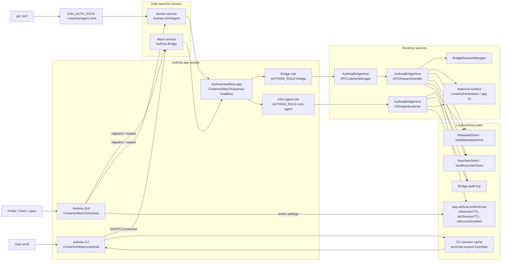

# Authsia macOS Runtime Architecture

This document describes the macOS runtime pieces that support the Authsia GUI,
CLI, XPC bridge, and built-in SSH agent. It is intended for debugging,
packaging, release smoke tests, and future security review.

## Goals

- Keep the GUI app, CLI, bridge, and SSH agent roles separate.
- Use a signed, bundled headless helper app for bridge and SSH work so those
  processes own the app's Keychain access group without becoming Dock-visible.
- Preserve on-demand operation through launchd so CLI and Git/SSH work when the
  GUI is closed.
- Keep private key and password material inside Authsia's vault/keychain paths.
- Make runtime state auditable with `authsia status`, `launchctl`, process
  parentage, and launchd role environment.

## Relationship Summary

The macOS runtime has one UI owner and two launchd-backed headless roles:

- `Authsia.app` is the GUI app and service registrar. It owns settings,
  approval UI, Sparkle updates, and first-launch repair of the bridge and SSH
  agent registrations.
- `AuthsiaHeadless.app` is the signed nested helper bundle under
  `Authsia.app/Contents/Helpers`. Its executable is `authsia-headless`, and the
  entry point selects a role before SwiftUI starts.
- `Authsia.Bridge` is the launchd Mach service used by the standalone `authsia`
  CLI. launchd starts `authsia-headless` with `AUTHSIA_ROLE=bridge`; that
  process owns the XPC listener and performs vault operations.
- `Authsia.SSHAgent` is the per-user socket-activated LaunchAgent for
  `~/.authsia/agent.sock`. launchd starts `authsia-headless` with
  `AUTHSIA_ROLE=ssh-agent`; that process speaks the OpenSSH agent protocol and
  enforces Authsia SSH key policy.
- Entitlements deliberately stop at app-owned bundles. `Authsia.app` and
  `AuthsiaHeadless.app` carry the app Keychain access group, which expands to
  `33M8QU65SP.app.authsia` for production signing. The standalone `authsia` CLI
  has no vault Keychain entitlements and reaches vault data only through
  `Authsia.Bridge`.

The reusable listener, request-policy, JIT/automation, and SSH-agent mechanics
are built from `Packages/AuthsiaBridgeHost`. The private app tree retains only
runtime composition and the AppKit/LocalAuthentication approval adapters.

## Process Model

| Process | Path | Launched by | Role | Dock/UI behavior |
|---|---|---|---|---|
| Authsia GUI | `/Applications/Authsia.app/Contents/MacOS/Authsia` | Finder, Dock, `open`, login/session restore | SwiftUI app, settings, approvals, service registration | Regular app |
| CLI | `/Applications/Authsia.app/Contents/Helpers/authsia` or user symlink | User shell | Sends XPC requests to `Authsia.Bridge` | No app UI |
| Bridge role | `/Applications/Authsia.app/Contents/Helpers/AuthsiaHeadless.app/Contents/MacOS/authsia-headless` with `AUTHSIA_ROLE=bridge` | launchd Mach service `Authsia.Bridge` | Headless XPC listener for CLI requests | Accessory/headless |
| SSH agent role | `/Applications/Authsia.app/Contents/Helpers/AuthsiaHeadless.app/Contents/MacOS/authsia-headless` with `AUTHSIA_ROLE=ssh-agent` | launchd socket activation `Authsia.SSHAgent` | Headless OpenSSH agent protocol server | Accessory/headless |

The CLI is a standalone helper without vault Keychain entitlements. The bridge
and SSH agent use the nested `AuthsiaHeadless.app` helper bundle, which contains
an `authsia-headless` executable copied from the app target, `LSUIElement=true`,
the app provisioning profile, and the app Keychain entitlements. At runtime, the
entry point decides whether to start a headless role before SwiftUI starts.

## Architecture Diagram



## Launchd Services

### Authsia.Bridge

The bridge LaunchAgent is bundled at:

```text
Authsia.app/Contents/Library/LaunchAgents/Authsia.Bridge.plist
```

It registers the Mach service `Authsia.Bridge` and runs:

```text
/Applications/Authsia.app/Contents/Helpers/AuthsiaHeadless.app/Contents/MacOS/authsia-headless
```

The GUI app registers this agent with `SMAppService.agent(plistName:)` during
normal app launch. The bridge is then started on demand when the CLI connects to
the Mach service. The plist sets `AUTHSIA_ROLE=bridge`, and launchd also exposes
`XPC_SERVICE_NAME=Authsia.Bridge`.

The stored registration identity includes the app bundle path, headless helper
path, registration schema, and app version/build. After a Sparkle update replaces
`/Applications/Authsia.app`, the first launch sees the version/build change and
unregisters then re-registers the bridge, so macOS Background Activity records
and launchd resources are refreshed for the newly installed bundle.

### Authsia.SSHAgent

The SSH agent plist is generated at runtime because the socket path must include
the current user's home directory:

```text
~/Library/LaunchAgents/Authsia.SSHAgent.plist
```

It runs:

```text
/Applications/Authsia.app/Contents/Helpers/AuthsiaHeadless.app/Contents/MacOS/authsia-headless
```

with:

```text
AUTHSIA_ROLE=ssh-agent
```

and owns:

```text
~/.authsia/agent.sock
```

through launchd socket activation. Shell integration points `SSH_AUTH_SOCK` at
that socket when it exists.

The SSH-agent registration identity also includes the app version/build. On the
first launch after an in-app update, Authsia boots out the old SSH LaunchAgent,
rewrites the plist, removes any stale socket, and bootstraps the new helper path
from the updated bundle.

## Startup Paths

The app entry point checks headless modes before starting SwiftUI:

1. Bridge mode: `AUTHSIA_ROLE == "bridge"` or
   `XPC_SERVICE_NAME == "Authsia.Bridge"`, and parent PID is launchd.
2. SSH agent mode: `AUTHSIA_ROLE == "ssh-agent"` and parent PID is launchd.
3. Otherwise, start the normal SwiftUI app.

Headless roles set `NSApplication` activation policy to accessory, install
`HeadlessLaunchForwarder`, and run only the role-specific listener. A user reopen
of a headless instance is forwarded to the real app bundle with `/usr/bin/open`
after stripping headless environment markers.

## CLI Request Flow

```text
authsia CLI
  -> NSXPCConnection(machServiceName: "Authsia.Bridge")
  -> Authsia.Bridge launchd Mach service
  -> AuthsiaHeadless.app executable in bridge role
  -> AuthsiaBridgeHost.XPCListenerManager
  -> AuthsiaBridgeHost.XPCRequestHandler
  -> VaultRepository / MetadataStore / KeychainStore
```

The CLI sends a `BridgeRequest` with command context and, when available, a
session token. The bridge validates policy, prompts through the app approval
surface when required, writes audit records, and returns a `BridgeResponse`.

`authsia list ssh` is a metadata audit view for adopted SSH keys. Like scraped
passwords, API keys, certificates, and notes, it defaults to current-machine items and
requires `--all-machines` to include keys from other machines. Current-machine
matching uses the stored machine ID first, then falls back to the stored machine
display name to tolerate local machine ID regeneration.

## Session Model

The authoritative CLI session lives in the app-side `BridgeSessionManager`.
Session tokens are returned to the CLI after approval and cached locally in a
terminal-scoped CLI Keychain item so later invocations from the same terminal
context can reuse the session. Automation credential shells and non-terminal
contexts do not read or write the interactive session cache.

CLI session TTL, SSH approval session TTL, and the global CLI access switch are read through
`BridgeSettings`.
GUI launches use `UserDefaults.standard`; headless bridge launches use the same
bundle identifier and preferences domain because `AuthsiaHeadless.app` keeps the
same `app.authsia` bundle identifier.

`authsia status` should prefer the bridge-reported session state from
`BridgePingPayload` when the bridge is reachable. The local cache is a fallback
for older bridge builds or bridge-unavailable diagnostics. This avoids reporting
a stale local cache as active after the bridge has restarted or reporting
inactive when the bridge owns a valid session but the local cache is missing.

## SSH Signing Flow

```text
git / ssh
  -> SSH_AUTH_SOCK=~/.authsia/agent.sock
  -> launchd socket activation
  -> AuthsiaHeadless.app executable in SSH-agent role
  -> AuthsiaBridgeHost.SSHAgentListener
  -> VaultMetadataStore / VaultKeychainStore
  -> approval policy + host binding
  -> OpenSSH-compatible signature response
```

The SSH agent advertises CLI-enabled keys that still have matching keychain
material. Signing enforces per-key CLI enablement, optional bound hosts, approval
policy, automation credential scope, and private-key passphrase handling.

Normal Git/SSH should use the built-in agent. `authsia load ssh --system-agent`
is only a compatibility escape hatch for copying keys into an external
`ssh-agent`.

## Packaging And Signing

Build scripts must ensure these files exist and are executable:

```text
Authsia.app/Contents/Helpers/authsia
Authsia.app/Contents/MacOS/Authsia
Authsia.app/Contents/Helpers/AuthsiaHeadless.app/Contents/MacOS/authsia-headless
```

The CLI executable is signed with hardened runtime and no Keychain
entitlements; it never reads vault secrets directly. The headless helper is a
nested app bundle, not a bare Mach-O helper. It must include:

- `Contents/Info.plist` with `CFBundleIdentifier=app.authsia`,
  `CFBundleExecutable=authsia-headless`, `CFBundlePackageType=APPL`, and
  `LSUIElement=true`.
- `Contents/embedded.provisionprofile` copied from the signed app build.
- A signature with the app Keychain/iCloud entitlements and DER entitlements.
- An rpath that lets the nested executable load frameworks from the outer app
  bundle, currently `@executable_path/../../../../Frameworks`.

Do not copy the app executable to bare `authsia-bridge` or `authsia-ssh-agent`
files and then add restricted entitlements such as `keychain-access-groups` to
those helpers: launchd/AMFI does not match them to the app bundle's embedded
provisioning profile, so the helpers can be rejected at exec time. Launchd
headless roles must run the signed nested `AuthsiaHeadless.app` executable.

### Entitlement Model

The app target entitlement source is:

```text
Authenticator/Authenticator/Authenticator.entitlements
```

It declares the app-owned Keychain and iCloud metadata capabilities:

```text
keychain-access-groups = $(AppIdentifierPrefix)app.authsia
com.apple.developer.ubiquity-kvstore-identifier = $(TeamIdentifierPrefix)$(CFBundleIdentifier)
com.apple.developer.icloud-container-identifiers = []
```

For the production team, Xcode expands the Keychain group to:

```text
33M8QU65SP.app.authsia
```

Only signed `.app` bundles should own this Keychain access group. This means:

- GUI mode reads and writes vault secrets through `Contents/MacOS/Authsia`.
- Bridge mode reads and writes vault secrets through the nested
  `AuthsiaHeadless.app` executable when launchd starts it with
  `AUTHSIA_ROLE=bridge`.
- SSH-agent mode reads SSH key material through the nested `AuthsiaHeadless.app`
  executable when launchd starts it with `AUTHSIA_ROLE=ssh-agent`.
- The bundled CLI at `Contents/Helpers/authsia` has no Keychain entitlements and
  must only talk to the bridge.
- Do not create bare helper copies with `keychain-access-groups`; they are not
  covered by the app bundle's provisioning profile and can be rejected before
  launch.

Useful inspection commands:

```bash
codesign --display --entitlements - /Applications/Authsia.app
codesign --display --entitlements - /Applications/Authsia.app/Contents/Helpers/AuthsiaHeadless.app
codesign --display --entitlements - /Applications/Authsia.app/Contents/Helpers/authsia
```

Expected result: the app and `AuthsiaHeadless.app` show
`keychain-access-groups` with `33M8QU65SP.app.authsia`; the CLI helper should
show no vault Keychain entitlements.

### Root Cause: Bridge Helper AMFI Rejection

The June 2026 CLI outage looked like every bridge-backed `authsia` command was
broken: `authsia status` and `authsia doctor` reported the bridge as
disconnected, and launchd showed `Authsia.Bridge` repeatedly scheduled or
exiting. The actual root cause was packaging, not CLI parsing or vault data.

`authsia-bridge`, `authsia-ssh-agent`, and later a flat `authsia-headless`
helper had been signed as bare helper executables with restricted Keychain
entitlements. AMFI rejected the helper at exec time because the app bundle's
embedded provisioning profile did not apply to those copied helper executables.
On macOS 26, that could surface as repeated Keychain access prompts followed by
empty CLI results. Unified logs showed messages like `No matching profile
found`, `restricted entitlements`, and launchd exits with `OS_REASON_EXEC`.

The durable fix is:

- Keep `authsia` as the only standalone CLI helper and sign it with hardened
  runtime and no Keychain entitlements.
- Package `AuthsiaHeadless.app` under `Contents/Helpers`, with `LSUIElement`, the
  app provisioning profile, and the app entitlements.
- Point `Authsia.Bridge.plist` and the generated `Authsia.SSHAgent.plist` at the
  nested `AuthsiaHeadless.app` executable with the role environment set.
- Sign the final `.app` bundle and `AuthsiaHeadless.app` with the app
  entitlements and DER entitlements so the headless roles can read the vault
  Keychain access group.
- Keep vault access behind the bridge process and storage APIs; do not make the
  standalone CLI a Keychain client with vault entitlements.

There was a second contributing behavior in diagnostics: `status` and `doctor`
used a direct `ping()` path, while other bridge commands already attempted one
launchd/app recovery pass. That made the bridge appear disconnected until a
manual bridge command nudged launchd. `ping()` must use the same bridge recovery
path as normal requests so diagnostics can cold-start or repair the LaunchAgent
state.

## Smoke Checks

After installing a build:

```bash
authsia status
authsia doctor
launchctl print "gui/$(id -u)/Authsia.Bridge"
launchctl print "gui/$(id -u)/Authsia.SSHAgent"
codesign --verify --verbose=4 /Applications/Authsia.app
codesign --verify --verbose=4 /Applications/Authsia.app/Contents/Helpers/AuthsiaHeadless.app
codesign --verify --verbose=4 /Applications/Authsia.app/Contents/Helpers/authsia
plutil -p /Applications/Authsia.app/Contents/Library/LaunchAgents/Authsia.Bridge.plist
```

Use `authsia list ...` only when intentionally validating vault metadata paths;
it does not print secrets, but it may print item names.

Expected runtime shape:

- One regular Authsia GUI process when the app is open.
- `authsia-headless` processes may appear when CLI or Git/SSH traffic starts
  launchd headless roles; they must have parent PID 1 and run from
  `Contents/Helpers/AuthsiaHeadless.app`.
- No second Dock icon should appear for CLI or SSH activity.
- `authsia status` should report bridge connectivity, authoritative session
  state, shell integration, and SSH agent socket state.
- `authsia doctor` should report `Authsia CLI: healthy` after first-use
  recovery has had a chance to bootstrap the bridge.

Cold-start recovery check:

```bash
launchctl bootout "gui/$(id -u)/Authsia.Bridge" 2>/dev/null || true
authsia status
authsia doctor
launchctl print "gui/$(id -u)/Authsia.Bridge"
```

`authsia status` should reconnect the bridge without needing a separate manual
bridge command first.

If a headless role exits immediately, inspect AMFI/signing logs before changing
code:

```bash
log show --last 10m \
  --predicate 'eventMessage CONTAINS[c] "Authsia.Bridge" OR eventMessage CONTAINS[c] "authsia-headless" OR eventMessage CONTAINS[c] "No matching profile found"'
```

If those logs mention missing provisioning profiles or restricted entitlements,
verify that launchd points at the nested `AuthsiaHeadless.app`, that the helper
app contains `embedded.provisionprofile`, and that it is signed with the app
entitlements. Do not add `keychain-access-groups` to a bare copied helper
executable.

## Common Failure Modes

| Symptom | Likely cause | Check |
|---|---|---|
| `authsia list ssh` is empty but `git pull` works | Installed CLI is older, or SSH list still applies scraped machine filtering | `authsia list ssh --all-machines --format table`; verify installed CLI after rebuild |
| `authsia status` reports stale session state | CLI is reading only local cache or bridge is an older build | Verify `BridgePingPayload` includes session state; rebuild app and CLI together |
| Second Authsia Dock icon appears after CLI/SSH | Headless detection or activation policy failed before SwiftUI started | Check `AUTHSIA_ROLE`, `XPC_SERVICE_NAME`, parent PID, and `HeadlessLaunchForwarder` |
| `authsia status` or `doctor` says bridge disconnected until another CLI command is run | Diagnostic ping path is not attempting bridge recovery | Ensure `ping()` uses the shared bridge recovery path |
| `launchctl` shows `Authsia.Bridge` exiting immediately with increasing run count | Program path missing, not executable, or signing/AMFI rejection | Check plist path, `codesign`, and unified logs for `No matching profile found` |
| All bridge-backed CLI commands fail after install | The LaunchAgent cannot exec the headless app role before registering the Mach service | Inspect launchd/AMFI logs; verify `ProgramArguments` points to `Contents/Helpers/AuthsiaHeadless.app/Contents/MacOS/authsia-headless` |
| `authsia list passwords` prompts repeatedly for Keychain access, then returns empty | Headless helper is missing the app provisioning profile or app Keychain entitlements | Verify the nested helper app signature, embedded profile, and LaunchAgent path |
| `authsia list passwords` shows metadata but `authsia load password --folder ...` says Keychain item not found | Metadata lookup succeeded, but the bridge cannot read the secret from the current or legacy vault Keychain service | Verify bridge is the entitled nested helper app; check `VaultKeychainStore` fallback from `com.authenticator.vault` to `com.authsia.vault` |
| SSH socket missing | SSH LaunchAgent not bootstrapped or socket directory removed | Launch GUI once, run `authsia status`, inspect `Authsia.SSHAgent` |
