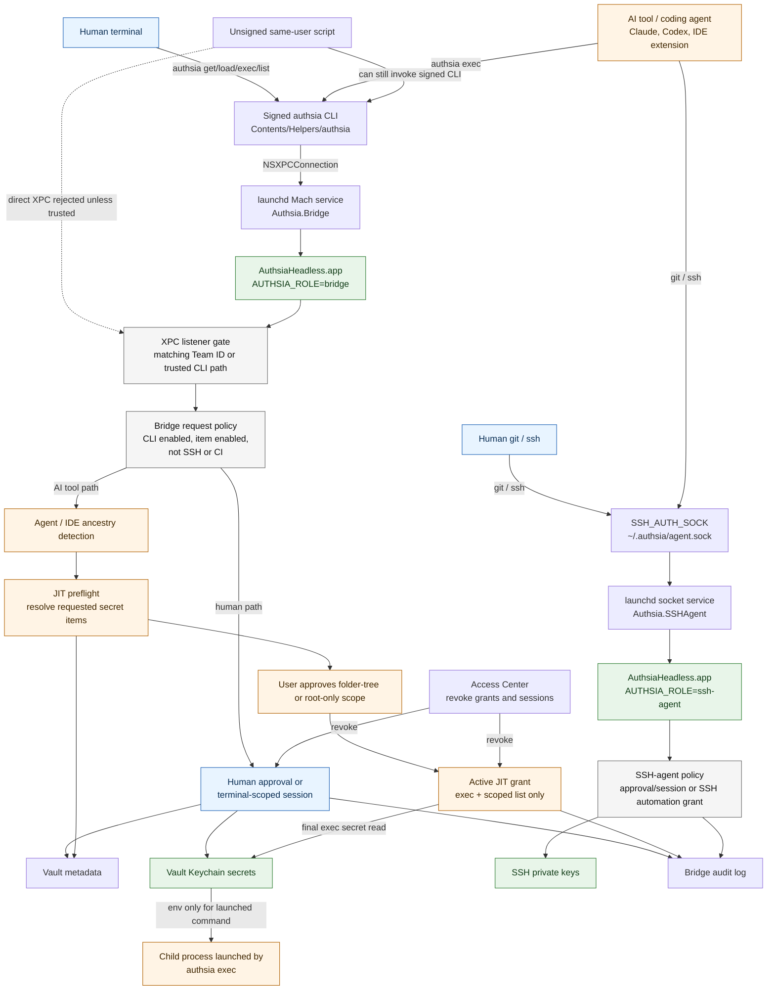

# Authsia Local Security Model

## Table of Contents

- [Security Goals](#security-goals)
- [Trust Boundaries](#trust-boundaries)
- [Security Flow](#security-flow)
- [Direct Bridge Access](#direct-bridge-access)
- [Human CLI Path](#human-cli-path)
- [AI Tool And JIT Path](#ai-tool-and-jit-path)
- [SSH-Agent Path](#ssh-agent-path)
- [Automation Credentials](#automation-credentials)
- [What The Model Does Not Guarantee](#what-the-model-does-not-guarantee)
- [Operational Checks](#operational-checks)

This document describes the local security model for Authsia's macOS CLI,
headless bridge, SSH agent, and just-in-time (JIT) agent grants. It focuses on
who can ask Authsia for secrets, which gates are applied, and what the design
does not try to protect against.

For detailed JIT grant behavior, see `Doc/ops/jit-agent-grants.md`.

## Security Goals

- Keep vault secrets and SSH private keys inside Authsia-owned Keychain paths.
- Keep the standalone `authsia` CLI unentitled; it reaches secrets only through
  the bridge or SSH-agent process.
- Accept bridge connections only from trusted local Authsia code.
- Require approval, a valid terminal-scoped human session, or a scoped
  automation/JIT grant before releasing secret material.
- Treat human terminal use and coding-agent use as different actors, even when
  they share a terminal or IDE.
- Make access visible and revocable through Access Center and audit logs.

## Trust Boundaries

| Boundary | Trusted side | Untrusted or less-trusted side | Main gate |
| --- | --- | --- | --- |
| Vault Keychain | `Authsia.app` and signed `AuthsiaHeadless.app` | CLI, shells, IDEs, scripts, tools | App Keychain entitlements |
| Bridge XPC | `Authsia.Bridge` headless role | Local processes in the user session | Code signature or bundled CLI path validation |
| CLI request policy | `AuthsiaBridgeHost.XPCRequestHandler` | CLI-provided request context and query data | CLI access switch, per-item CLI flag, session, approval, JIT, automation credentials |
| Human session | Bridge session manager | Repeated CLI invocations | Terminal/session-scoped token and replay checks |
| JIT grant | Active grant store | Coding agents and IDE helper processes | Caller fingerprint, named-folder subtree or root-only scope, TTL, allowed command |
| SSH signing | `Authsia.SSHAgent` headless role | `git`, `ssh`, and their callers | SSH key policy, approval/session, automation SSH grant |

The reusable gates and headless runtime mechanics are owned by
`Packages/AuthsiaBridgeHost`. Private app code supplies approval and passphrase
UI through injected protocols; it does not replace the package policy checks.

## Security Flow



## Direct Bridge Access

`Authsia.Bridge` is a per-user launchd Mach service, not a network service. The
listener accepts a connection only after validating the connecting process.
Current acceptance rules are:

- signed caller has the same Team ID as the bridge process
- or the caller executable path resolves to the bundled `authsia` CLI
- or, for development builds, the caller path is the SwiftPM-built
  `Packages/AuthsiaCLI/.build/.../authsia`

Random unsigned binaries and scripts should not be able to connect directly to
the bridge. However, a script running as the same macOS user can still invoke
the signed `authsia` CLI. That is intentional: the CLI is the local user-facing
interface. Secret release is therefore controlled by request policy, not only by
XPC connection acceptance.

Same-Team-ID code is treated as trusted Authsia code. If a same-team helper is
compromised or an unintended same-team binary speaks the bridge protocol, the
signature boundary has already failed. Request policy still applies, but the
system should not be described as protecting against compromised trusted code.

## Human CLI Path

Human terminal use follows the normal CLI path:

1. User runs `authsia get`, `authsia load`, `authsia exec`, or `authsia list`.
2. The CLI sends a bridge request through `Authsia.Bridge`.
3. The bridge checks global CLI access and the target item's CLI-enabled flag.
4. If no valid terminal-scoped session exists, Authsia asks for user approval.
5. The bridge reads the secret from Keychain and records an audit event.

Human sessions are scoped by terminal and process-session identity. Access
Center can show active human sessions when `Include human sessions` is enabled,
and revoking one has the same authorization effect as `authsia lock` for that
scope.

## AI Tool And JIT Path

Coding agents are treated as a separate actor from the human who owns the
terminal. When no explicit automation credential is supplied, confirmed
`agentRuntimeContext` selects JIT; automation credentials are evaluated through
their separate authorization path. An ancestry-only agent or IDE helper
invocation also selects JIT when stdin is not a TTY.

An IDE or agent name in the ancestry is not enough to establish an ongoing
human session. That path requires stdin TTY plus the server-current session
token for the same terminal scope. TTY alone is neither authorization nor a
classifier override. A first stdin-TTY request with no confirmed agent runtime
context can reach a narrow biometric bootstrap, but it receives no metadata or
secret before approval and then mints the normal scoped terminal session.
Active JIT grants do not authorize bootstrap or human list requests. Redirected
stdout does not change routing because this decision uses stdin TTY;
`TerminalContext.isInteractiveSession` remains a separate stdin-and-stdout UI
check for interactive terminal interfaces.

When JIT is required:

1. The CLI collects the secret references that `exec` will need.
2. The bridge resolves those references against live metadata.
3. Every item must exist and be CLI-enabled.
4. Items are grouped by named-folder subtree or root-only scope; covered
   descendant scopes collapse into their ancestor.
5. The CLI may attach optional hook-provided agent attribution for display when
   a recent hook marker and the process ancestry agree on the coding tool.
6. The user approves each missing scope or missing capability. A separate
   approval explains whether the request adds an unrelated folder tree or a new
   capability. A first broad unscoped list with no active scopes says `across
   all resolved folders` without enumerating pending paths. If active grants
   exist and separate approval adds unrelated scopes, the prompt lists pending
   new folder paths and active scopes. No broad prompt names items or secrets.
7. The bridge stores short-lived grants bound to the caller fingerprint,
   terminal/session scope, working directory, TTL, and folder-tree/root scope.
8. Final secret reads must match an active grant.

Agent attribution improves Access Center and audit readability, but it is not
attestation. Hook records are local metadata, store an invocation marker instead
of raw command text, and are not used as an authorization boundary.

JIT grants allow only:

- `exec`
- scoped `list` needed by `exec` resolution or supported direct metadata list
  requests

JIT grants do not authorize `get`, `read`, `inject`, `load`, SSH signing, OTP
access, add, edit, delete, or export.

Without an explicit automation credential, confirmed agent non-`exec` secret
reads fail closed even when the same terminal has an active human CLI session.
An ancestry-only stdin-TTY caller uses the human path only after presenting the
server-current same-scope token or completing biometric bootstrap. OTP and SSH
`authsia://` references are rejected for agentic `exec` JIT; SSH use goes
through the SSH-agent path instead.

A named-folder grant covers that folder and slash-delimited descendants. A
grant for `Team/API` includes `Team/API/Prod`, but not `Team`, `Team/Web`, or
`Team/API2`; a descendant request reuses the ancestor grant. Root is a special
root-only scope and never means the whole vault. Unrelated folder trees require
separate approval, and a capability not already present can require another
approval. These scope rules do not change folder-qualified `get` or `load`
exact-item selection.

## SSH-Agent Path

The SSH agent is a separate headless role reached through
`~/.authsia/agent.sock`, normally via `SSH_AUTH_SOCK`.

`git` and `ssh` do not talk to `Authsia.Bridge`; they talk to
`Authsia.SSHAgent`. The SSH-agent role reads allowed private keys through
Authsia's vault Keychain entitlement and enforces SSH-specific approval and
session policy.

JIT grants are not SSH grants. Agentic SSH use should rely on explicit
automation credentials that include the `ssh` capability, or on the normal SSH
approval/session path when a human is driving the command.

## Automation Credentials

Automation credentials are explicit local credentials managed by
`authsia access`. They are separate from human sessions and JIT grants.

An automation request must pass all of these checks:

- credential exists in the local access credential store
- credential is active, not expired or revoked
- credential matches the current machine ID
- requested command is in `allowedCommands`
- requested item or folder is inside the credential scope

Automation credentials bypass biometric prompts by design. They should be
short-lived and narrowly scoped.

## What The Model Does Not Guarantee

Authsia is a local password manager, not a malware sandbox. These cases are out
of scope for app-level controls:

- root or administrator compromise
- malware that can read another process's memory or tamper with the installed
  app bundle
- compromised Authsia-signed code
- a user approving a misleading prompt
- a same-user process invoking the signed CLI with the server-current token for
  an already-approved human session in the same terminal scope

The design reduces blast radius by using CLI-enabled item flags, named-folder
JIT subtrees or root-only scope, TTLs, terminal-scoped human sessions, audit
logs, and Access Center revocation. It should not be documented as preventing all same-user
malware from attempting to use the CLI.

## Operational Checks

Use these checks when validating the security model on a real Mac. Do not print
secret values while testing.

```sh
authsia status --format json
launchctl print "gui/$(id -u)/Authsia.Bridge"
launchctl print "gui/$(id -u)/Authsia.SSHAgent"
authsia audit list --limit 20
authsia audit verify
authsia access list --format table
```

For non-leaking secret-read validation:

```sh
authsia exec password SERVICE_ENDPOINT --shell 'test -n "$SERVICE_ENDPOINT" && echo SERVICE_ENDPOINT=set'
```
