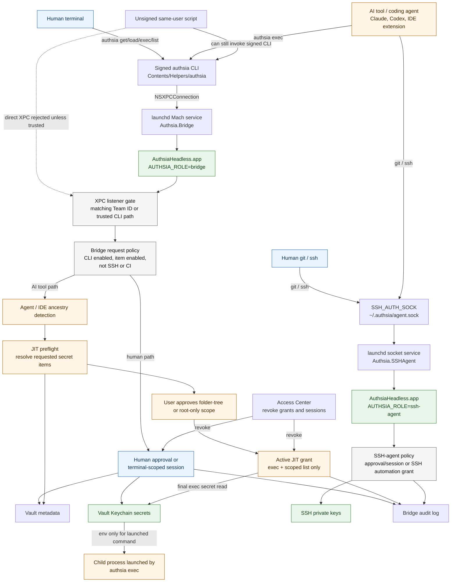
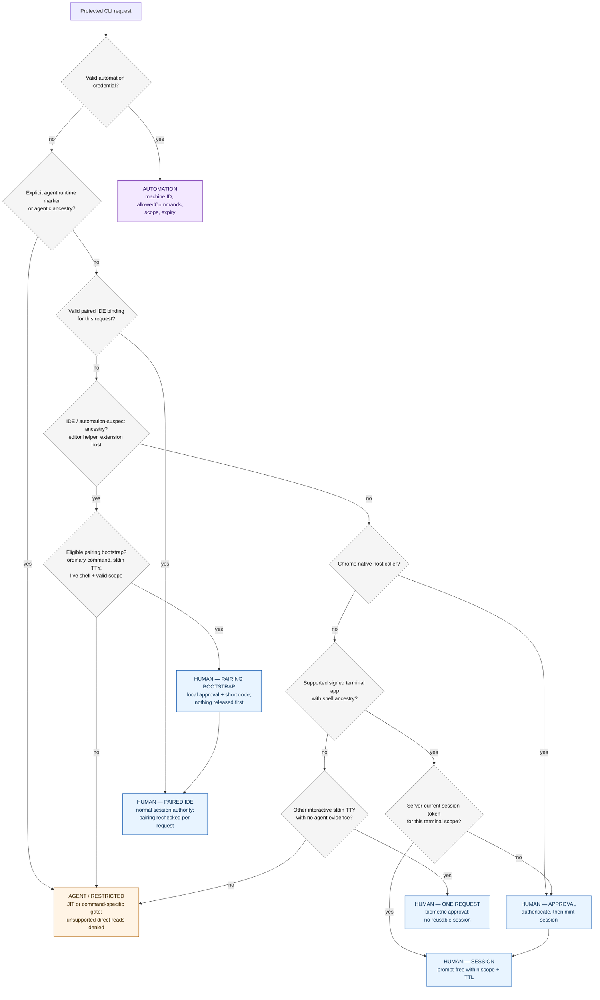

# Authsia Local Security Model

## Table of Contents

- [How It Works In Brief](#how-it-works-in-brief)
- [Security Goals](#security-goals)
- [Trust Boundaries](#trust-boundaries)
- [Keychain Storage And Access Control](#keychain-storage-and-access-control)
- [Security Flow](#security-flow)
- [Direct Bridge Access](#direct-bridge-access)
- [Caller Classification](#caller-classification)
- [Human CLI Path](#human-cli-path)
- [IDE Terminal Pairing](#ide-terminal-pairing)
- [AI Tool And JIT Path](#ai-tool-and-jit-path)
- [Local MCP Adapter](#local-mcp-adapter)
- [SSH-Agent Path](#ssh-agent-path)
- [Automation Credentials](#automation-credentials)
- [What The Model Does Not Guarantee](#what-the-model-does-not-guarantee)
- [Operational Checks](#operational-checks)

This document describes the local security model for Authsia's macOS CLI,
headless bridge, SSH agent, and just-in-time (JIT) agent grants. It focuses on
who can ask Authsia for secrets, which gates are applied, and what the design
does not try to protect against.

For detailed JIT grant behavior, see [`jit-agent-grants.md`](jit-agent-grants.md).

## How It Works In Brief

1. Secrets and SSH private keys stay in Authsia-owned Keychain storage. The
   unentitled CLI asks the signed local Bridge or SSH-agent service to use them;
   it cannot read that Keychain storage directly.
2. The Bridge first verifies the caller and request policy. A human uses a
   terminal-scoped session or approval. A coding agent gets a separate JIT
   approval bound to the caller, requested items, workspace, environment,
   capability, and expiry. Unattended automation and SSH signing use their own
   scoped authority paths.
3. For `authsia exec` and secret-bearing `authsia workspace run`, live policy
   is checked again immediately before release. Values are placed only in the
   launched child's environment, not in the parent shell.
4. Authsia strictly masks known values and recognized representations in that
   child's stdout and stderr. After an Agent JIT grant authorizes `authsia exec`
   or a secret-bearing `workspace run`, bounded post-exit inspection looks for
   eligible injected values (12+ characters) and supported one-layer Base64,
   URL-safe Base64, hexadecimal, percent/form, shell, HTML, and JSON
   representations in observed files. Matching representations are replaced
   with `<concealed by authsia>` while surrounding and unrelated file content
   remains unchanged. Ordinary human CLI sessions and reusable automation
   credentials do not start file observation or cleanup. Child exit codes
   remain unchanged by inspection or cleanup.
5. Access Center and redacted audit records make grants, sessions, findings,
   and revocation visible. This reduces accidental disclosure and limits
   authority; it is not operating-system-wide DLP and cannot stop an approved
   child from exfiltrating a value through an unmanaged channel.

## Security Goals

- Keep vault secrets and SSH private keys inside Authsia-owned Keychain paths.
- Keep the standalone `authsia` CLI unentitled; it reaches secrets only through
  the bridge or SSH-agent process.
- Accept bridge connections only from trusted local Authsia code.
- Require approval, a valid terminal-scoped human session, or a scoped
  automation/JIT grant before releasing secret material.
- Treat human terminal use and coding-agent use as different actors, even when
  they share a terminal or IDE.
- Make access visible and revocable through Access Center and audit logs.

## Trust Boundaries

| Boundary | Trusted side | Untrusted or less-trusted side | Main gate |
| --- | --- | --- | --- |
| Vault Keychain | `Authsia.app` and signed `AuthsiaHeadless.app` | CLI, shells, IDEs, scripts, tools | Data protection keychain, gated by the signed `keychain-access-groups` entitlement and shared access group |
| Bridge XPC | `Authsia.Bridge` headless role | Local processes in the user session | Code signature or bundled CLI path validation |
| CLI request policy | `AuthsiaBridgeHost.XPCRequestHandler` | CLI-provided request context and query data | CLI access switch, per-item CLI flag, session, approval, JIT, automation credentials |
| Human session | Bridge session manager | Repeated CLI invocations | Terminal/session-scoped token and replay checks |
| JIT grant | Active grant store | Coding agents and IDE helper processes | Caller fingerprint, named-folder subtree or root-only scope, TTL, allowed command |
| Local MCP adapter | Signed `authsia mcp serve` process and existing Bridge/JIT path | MCP client, model, tool arguments, and client metadata | Closed tool schemas, workspace lock, JIT-only child environment, existing JIT policy, instance-narrowed MCP grant reuse |
| SSH signing | `Authsia.SSHAgent` headless role | `git`, `ssh`, and their callers | SSH key policy, approval/session, automation SSH grant |

The reusable gates and headless runtime mechanics are owned by
`Packages/AuthsiaBridgeHost`. Private app code supplies approval and passphrase
UI through injected protocols; it does not replace the package policy checks.

## Keychain Storage And Access Control

Vault secrets, SSH private keys, and OTP seeds are Keychain items. "The Keychain"
on macOS is three separate stores with different enforcement, and which store a
record lands in decides what can read it outside Authsia.

Every local write sets `kSecUseDataProtectionKeychain` and the shared access
group read from the signed `keychain-access-groups` entitlement, at
`kSecAttrAccessibleWhenUnlocked`. `AuthsiaHeadless.app` carries the same shared
group alongside its own, which is how the Bridge and SSH-agent roles reach the
app's records.

| Store | When Authsia writes there | Enforcement | Readable by `security(1)` | Shown in Keychain Access |
| --- | --- | --- | --- | --- |
| Data protection keychain | Every local, non-synchronizable write | Code-signed entitlement and access group; no per-item ACL | No | No |
| iCloud keychain | An added copy per write, when iCloud Keychain Sync is enabled | Apple's iCloud Keychain protection, bound to the Apple Account and its trusted devices | No | Yes, under **iCloud** |
| File-based login keychain | Only as a fallback, when a data-protection write returns `errSecMissingEntitlement` | Per-item ACL the user can widen to "Always Allow" | **Yes** | Yes |

The file-based login keychain is the weak one. Its per-item ACL is a prompt the
user can answer permanently, and once answered, `security find-generic-password -w`
prints the raw secret to any same-user process — no Bridge, no approval, no audit
record. Records reach that store only when the entitlement is unavailable, which
in practice means an unsigned or improperly provisioned build.

The other two stores are `securityd`-managed and absent from the `security(1)`
search list, so the legacy `SecKeychain*` API that `security(1)` uses cannot reach
them at all. Access there is decided by the caller's code signature, not by a
prompt a user can answer once and forget.

Reads try the data protection store first and the file-based store second, so a
record stranded by an earlier entitlement failure still resolves. Read-time
backfill rewrites a record only when it was found under a legacy *service name*;
a record found in the file-based store under the current service name is returned
as-is and stays in that weaker store, where it remains exportable until removed.

Enabling iCloud Keychain Sync does not move existing records. It adds a second,
synchronizable copy of each subsequent write. Synchronizable items do not carry
`kSecUseDataProtectionKeychain`; they live in the iCloud keychain, replicate to
the other devices on the Apple Account, and appear in Keychain Access under
**iCloud**. Authsia sets no `kSecAttrAccessControl` on any item, because a
user-presence check would break unattended Bridge and SSH-agent operation, so a
user who authenticates to Keychain Access can reveal a synced value directly.
That read bypasses the Bridge and produces no approval prompt and no audit
record. See
[What The Model Does Not Guarantee](#what-the-model-does-not-guarantee).

## Security Flow



## Direct Bridge Access

`Authsia.Bridge` is a per-user launchd Mach service, not a network service. The
listener accepts a connection only after validating the connecting process.
Current acceptance rules are:

- signed caller has the same Team ID as the bridge process
- or the caller executable path resolves to the bundled `authsia` CLI
- or, for development builds, the caller path is the SwiftPM-built
  `Packages/AuthsiaCLI/.build/.../authsia`

Random unsigned binaries and scripts should not be able to connect directly to
the bridge. However, a script running as the same macOS user can still invoke
the signed `authsia` CLI. That is intentional: the CLI is the local user-facing
interface. Secret release is therefore controlled by request policy, not only by
XPC connection acceptance.

Same-Team-ID code is treated as trusted Authsia code. If a same-team helper is
compromised or an unintended same-team binary speaks the bridge protocol, the
signature boundary has already failed. Request policy still applies, but the
system should not be described as protecting against compromised trusted code.

## Caller Classification

Every protected CLI request is routed to exactly one of three actors before any
gate runs: **automation**, **agent**, or **human**. Classification decides which
authority a request may use, so it happens before approval, not after.

### Evidence Per Actor

| Actor | Selecting evidence | Forgeable by the caller? |
| --- | --- | --- |
| Automation | Automation credential ID/token in the request context or `AUTHSIA_*` credential environment key | Yes as a claim; useless without a stored, active, machine-matched credential |
| Agent | Explicit agent runtime marker: platform key plus a truthy invokes-Authsia key | Yes — treated as a self-declaration that only ever *adds* restriction |
| Agent | Agentic ancestry: process name, argv[0], or bundle identifier matching a known agent (`claude`, `codex`, `cursor-agent`, `github-copilot`, `windsurf-agent`), or a Copilot extension path in argv | No — read from the process tree by the bridge |
| Agent | IDE / automation-suspect ancestry: editor helper process names, `.app` bundle paths in argv, `--type=extensionHost`, or IDE bundle identifiers; this selects the restricted path unless an exact paired-human binding validates | No — read from the process tree by the bridge |
| Human | Trusted terminal ancestry (Terminal, iTerm2, Ghostty, Warp) with a shell parent; a server-current token authorizes prompt-free reuse but does not establish the actor | No — ancestry is observed; the token is server-held |
| Human | Paired IDE terminal with host-derived TTY, live shell PID/start time, shell-only ancestry, and validated managed-workspace root or exact current directory; a server-current token authorizes prompt-free reuse | No — the binding is derived and rechecked by the bridge |

Identity is read from the **process tree**, not from anything the caller says
about itself. `argv[0]` counts even as a bare word, because a PATH symlink hides
the agent's identity from the resolved executable name — `codex` resolves to a
binary named `codex-aarch64-apple-darwin`. Later arguments count only when they
are real filesystem paths, so an operand such as `grep codex notes.txt` never
makes a plain command agentic.

### Precedence



The default at the bottom of the chain is the agent path: a caller that is
neither recognizable automation nor an established human path is treated as an
agent/restricted caller. JIT is available only for supported capabilities and
commands; management and export keep their command-specific high-friction
policy, while unsupported direct secret reads are denied. Classification fails
toward more restriction, not less.

### Terminal And IDE Outcomes

| Origin | Decisive evidence | Classification and gate |
| --- | --- | --- |
| Terminal.app, iTerm2, Ghostty, or Warp | Supported signed host plus shell ancestry | Human; reuse a valid same-scope session or authenticate and mint one |
| VS Code, Cursor, Windsurf, or another IDE-integrated terminal | Exact live pairing matches TTY, shell anchor, and managed-workspace root or current directory | Paired human; direct `list` and ordinary human commands may reuse the normal session |
| Eligible unpaired IDE-integrated terminal | No agent evidence; stdin TTY; live shell anchor; valid pairing scope; pairing-supported ordinary command | Pairing bootstrap; local authentication and app-to-terminal code occur before release |
| Unpaired IDE direct `list`, `exec`, or a command pairing cannot authorize | IDE / automation-suspect ancestry without a valid pairing | Agent/restricted; JIT for supported list/exec, command-specific biometric gates for management/export, and denial for unsupported direct reads |
| Any terminal or IDE with explicit agent runtime or agentic ancestry | Runtime marker or host-observed known-agent process | Agent; pairing and human session evidence cannot override it |
| Unknown terminal host with interactive stdin and no agent evidence | TTY only admits the narrow bootstrap; host is not trusted for reuse | Human for one biometrically approved request; no reusable session |
| Chrome native host | Private marker plus verified native-host ancestry | Dedicated human/autofill approval or session path |
| CI or non-interactive SSH without a valid automation credential | No established human path | Agent/restricted default; separate SSH-agent policy still governs SSH signing |

### Both Sides Must Agree

Classification runs twice, from different vantage points:

- The **CLI** decides whether to run a JIT preflight
  (`Exec.shouldRunJITPreflight`), using its own process ancestry and
  environment. Before direct `list` preflight, it asks the bridge whether the
  exact current caller owns a valid terminal pairing.
- The **bridge host** decides whether a grant is required
  (`XPCRequestHandler.isAgentJITCaller`), using the XPC peer's ancestry.

These must reach the same verdict for the same caller. If the host demands a
list grant the CLI's local detector did not expect — including an unrecognized
agent such as Grok — the CLI still runs list JIT preflight. If the CLI still
preflights a caller the host does not treat as an Agent JIT caller, the host
returns empty grants without opening approval or writing an `agentJITPreflight`
audit record.

Because the two run in different processes, they read different evidence: the
CLI has argv for the whole ancestry, while the host has code-signing identity,
bundle identifiers, and the authoritative pairing store. Any classification
rule added to one side needs the matching rule on the other. A bridge-reported
pairing may suppress unnecessary client-side list preflight; local state alone
must never claim paired-human authority.

### What The Terminal Does And Does Not Decide

A TTY is **not** a classifier. An agent hosted inside an IDE presents the same
process ancestry *and* the same controlling terminal as the human sitting at
that IDE, so the terminal cannot separate them. Treating stdin TTY as evidence
of a human would let an IDE-hosted agent reuse the human's session authority.

The terminal is therefore used only where a human is already established by
other means:

- as one requirement of an ongoing human session, alongside the server-current
  session token for the same terminal scope
- to admit the narrow biometric bootstrap, which is available only when there is
  no agent evidence at all and which releases no metadata or secret before
  approval
- as the host-derived endpoint of an IDE terminal pairing whose live shell
  anchor and workspace are revalidated on every request

Redirected stdout does not affect routing. `TerminalContext.isInteractiveSession`
is a separate stdin-and-stdout check for terminal user interfaces, not an
authorization input.

## Human CLI Path

Human terminal use follows the normal CLI path:

1. User runs `authsia get`, `authsia load`, `authsia exec`, or `authsia list`.
2. The CLI sends a bridge request through `Authsia.Bridge`.
3. The bridge checks global CLI access and the target item's CLI-enabled flag.
4. If no valid terminal-scoped session exists, Authsia asks for user approval.
5. The bridge reads the secret from Keychain and records an audit event.

Human sessions are scoped by terminal and process-session identity. Access
Center can show active human sessions when `Include human sessions` is enabled,
and revoking one has the same authorization effect as `authsia lock` for that
scope.

## IDE Terminal Pairing

An automation-suspect IDE terminal cannot become human merely by presenting a
TTY or client-supplied session scope. Its first eligible ordinary secret request
opens a local panel showing host-derived workspace, controlling terminal,
anchor shell PID, full command, and a short code. After Touch ID or Mac-password
approval, the human enters the app-displayed code in that terminal. Pairing
creates the normal configured-duration CLI session.

Every request rechecks the host-derived TTY, exact anchor PID/start time,
shell-only ancestry, the validated managed-workspace root when one exists or
the exact current directory otherwise, expiry, and absence of agent runtime
evidence. Pairing never authorizes `access` or `export`, and is local-only.

Pairing establishes which terminal a human confirmed once; it is not proof of
human identity. The primary accepted risk is terminal injection: an IDE API can
type a visible command into a paired panel and reuse the session until expiry.
Lifecycle and use are audited; `authsia lock`, Access
Center revocation, anchor exit, or TTL expiry ends authority. Existing macOS
screen-recording permission and same-user native TTY theft remain outside this
defense.

## AI Tool And JIT Path

Coding agents are treated as a separate actor from the human who owns the
terminal. See [Caller Classification](#caller-classification) for how a request
is routed to this path. When no explicit automation credential is supplied,
confirmed `agentRuntimeContext` selects JIT; automation credentials are
evaluated through their separate authorization path. Agentic ancestry always
selects JIT. IDE-helper ancestry selects JIT unless the bridge validates an
exact paired-human binding for that request; pairing never overrides explicit
runtime or agent-process evidence.

An IDE or agent name in the ancestry is not enough to establish an ongoing
human session. That path requires stdin TTY plus the server-current session
token for the same terminal scope. TTY alone is neither authorization nor a
classifier override. A first stdin-TTY request with no agent evidence at all
can reach a narrow biometric bootstrap, but it receives no metadata or secret
before approval and then mints the normal scoped terminal session. Active JIT
grants do not authorize bootstrap or human list requests.

When JIT is required:

1. The CLI collects the secret references that `exec` will need.
2. The bridge resolves those references against live metadata.
3. Every item must exist and be CLI-enabled.
4. Items are grouped by named-folder subtree or root-only scope; covered
   descendant scopes collapse into their ancestor.
5. The CLI may attach optional hook-provided agent attribution for display when
   a recent hook marker and the process ancestry agree on the coding tool.
6. The user approves each missing scope or missing capability. A separate
   approval explains whether the request adds an unrelated folder tree or a new
   capability. A first broad unscoped list with no active scopes says `across
   all resolved folders` without enumerating pending paths. If active grants
   exist and separate approval adds unrelated scopes, the prompt lists pending
   new folder paths and active scopes. No broad prompt names items or secrets.
7. The bridge stores short-lived grants bound to the caller fingerprint,
   terminal/session scope, working directory, TTL, and folder-tree/root scope.
8. Final secret reads must match an active grant.

Agent attribution improves Access Center and audit readability, but it is not
attestation. Hook records are local metadata, store an invocation marker instead
of raw command text, and are not used as an authorization boundary.

JIT grants allow only:

- `exec`
- scoped `list` needed by `exec` resolution or supported direct metadata list
  requests

JIT grants do not authorize `get`, `read`, `inject`, `load`, SSH signing, OTP
access, add, edit, delete, or export.

Without an explicit automation credential, confirmed agent non-`exec` secret
reads fail closed even when the same terminal has an active human CLI session.
An ancestry-only stdin-TTY caller uses the human path only after presenting the
server-current same-scope token or completing biometric bootstrap. OTP and SSH
`authsia://` references are rejected for agentic `exec` JIT; SSH use goes
through the SSH-agent path instead.

A named-folder grant covers that folder and slash-delimited descendants. A
grant for `Team/API` includes `Team/API/Prod`, but not `Team`, `Team/Web`, or
`Team/API2`; a descendant request reuses the ancestor grant. Root is a special
root-only scope and never means the whole vault. Unrelated folder trees require
separate approval, and a capability not already present can require another
approval. These scope rules do not change folder-qualified `get` or `load`
exact-item selection.

## Local MCP Adapter

The local MCP server is a constrained adapter over the existing AI Tool and JIT
path. It exposes status, commit-safe workspace reference inspection, scoped
CLI-enabled Vault metadata listing, current-instance grant status/revocation,
and mediated execution over local `stdio`. It exposes no plaintext-secret, OTP,
SSH signing, write, export, or global audit tool.

`authsia_exec` launches the same resolved Authsia binary through `workspace run`
with a server-generated MCP runtime context. It removes automation credentials
from the child environment, so V1 always reaches Agent JIT when secrets are
required. Client name/version and MCP runtime labels are not caller attestation.
OS-observed caller identity, workspace, item scope, environment, capability,
TTL, approval, and final Bridge revalidation remain mandatory.

An MCP server-instance ID may narrow reuse of an MCP-created grant. It can never
authorize a grant by itself or broaden ordinary JIT matching. A restarted MCP
server therefore obtains a new grant instead of silently reusing a prior MCP or
direct-agent grant.

The MCP client receives only masked, bounded command output. Existing Bridge
audit and agent activity stores carry the grant, server-instance, and tool-call
correlation; MCP adds no separate approval authority, bearer, or log. Full tool,
lifecycle, threat, and compatibility rules are in
[`authsia-mcp.md`](authsia-mcp.md).

## SSH-Agent Path

The SSH agent is a separate headless role reached through
`~/.authsia/agent.sock`, normally via `SSH_AUTH_SOCK`.

`git` and `ssh` do not talk to `Authsia.Bridge`; they talk to
`Authsia.SSHAgent`. The SSH-agent role reads allowed private keys through
Authsia's vault Keychain entitlement and enforces SSH-specific approval and
session policy.

JIT grants are not SSH grants. Agentic SSH use should rely on explicit
automation credentials that include the `ssh` capability, or on the normal SSH
approval/session path when a human is driving the command.

## Automation Credentials

Automation credentials are explicit local credentials managed by
`authsia access`. They are separate from human sessions and JIT grants.

An automation request must pass all of these checks:

- credential exists in the local access credential store
- credential is active, not expired or revoked
- credential matches the current machine ID
- requested command is in `allowedCommands`
- requested item or folder is inside the credential scope

Automation credentials bypass biometric prompts by design. They should be
short-lived and narrowly scoped.

## What The Model Does Not Guarantee

Authsia is a local password manager, not a malware sandbox. These cases are out
of scope for app-level controls:

- root or administrator compromise
- malware that can read another process's memory or tamper with the installed
  app bundle
- compromised Authsia-signed code
- a user approving a misleading prompt
- a same-user process invoking the signed CLI with the server-current token for
  an already-approved human session in the same terminal scope
- a user who authenticates to Keychain Access with the login password or Touch ID
  reading a synchronizable item's value directly, when iCloud Keychain Sync is
  enabled; that read never reaches the Bridge, so it raises no approval prompt and
  leaves no audit record. Local, non-synchronizable records are not exposed this
  way; see
  [Keychain Storage And Access Control](#keychain-storage-and-access-control)
- values in records left in the file-based login keychain by an unsigned or
  improperly provisioned build, which `security find-generic-password -w` can
  export after a single ACL approval

The design reduces blast radius by using CLI-enabled item flags, named-folder
JIT subtrees or root-only scope, TTLs, terminal-scoped human sessions, audit
logs, and Access Center revocation. It should not be documented as preventing all same-user
malware from attempting to use the CLI.

## Operational Checks

Use these checks when validating the security model on a real Mac. Do not print
secret values while testing.

```sh
authsia status --format json
launchctl print "gui/$(id -u)/Authsia.Bridge"
launchctl print "gui/$(id -u)/Authsia.SSHAgent"
authsia audit list --limit 20
authsia audit verify
authsia access list --format table
```

For non-leaking secret-read validation:

```sh
authsia exec password SERVICE_ENDPOINT --shell 'test -n "$SERVICE_ENDPOINT" && echo SERVICE_ENDPOINT=set'
```

To confirm no vault record is sitting in the file-based login keychain, where
`security(1)` could export it. A correctly provisioned install reports `0`; a
non-zero count means records were written by a build without the entitlement and
are still exportable:

```sh
security dump-keychain | grep -c '"svce"<blob>="com.authsia.vault"'
```

`dump-keychain` without `-d` prints attributes only, never secret values. It also
cannot see the data protection or iCloud stores, so a `0` here is evidence about
the file-based keychain alone.
